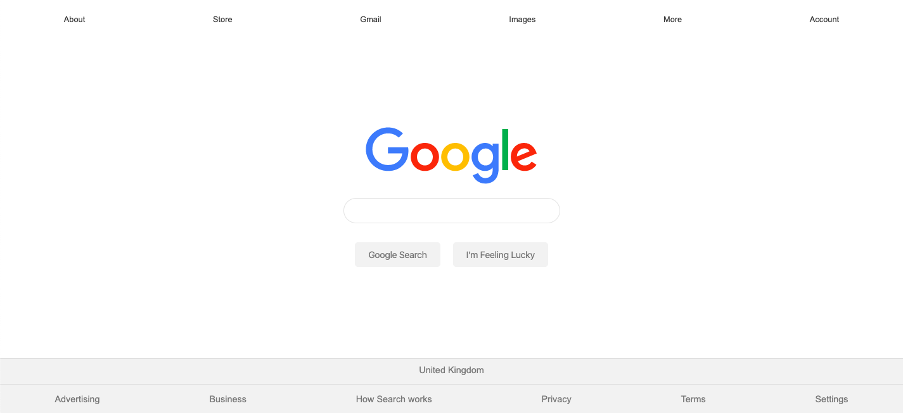

# Google Homepage

## How To Open
> 1. Go to the build folder in the project's download folder
> 2. Right click on the file named _index.html_
> 3. Choose the _open with_ option
> 4. Open the project in your desired browser

## How To Use
> 1. Type in the search input field
> 2. Press search buttons to perform query on Google

## Requirements
> 1. This project requires a browser to run
> 2. The browser must have JavaScript available and enabled

## User Stories
> 1. Users can perform searches on Google

## Preview

